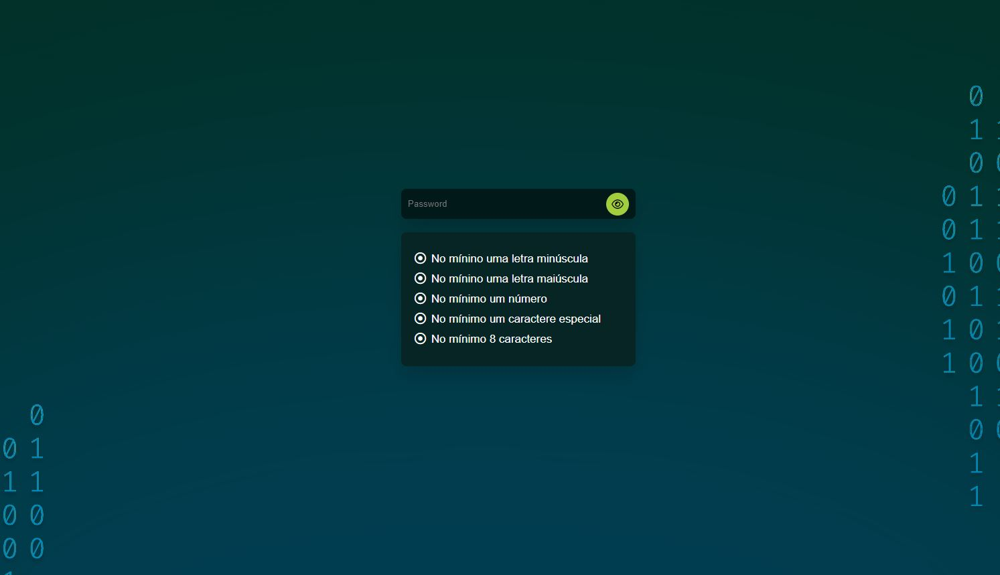

<h1 align="center"> Password Validation Check </h1>

Miniprojeto desenvolvido em HTML, CSS e JavaScript, o intuito desse projeto é aprimorar o conhecimento de manipulação do DOM com o javascript.

  <a href="#-tecnologias">Tecnologias</a>&nbsp;&nbsp;&nbsp;|&nbsp;&nbsp;&nbsp;
  <a href="#-projeto">Projeto</a>&nbsp;&nbsp;&nbsp;|&nbsp;&nbsp;&nbsp;
  <a href="#-Deploy">Deploy</a>&nbsp;&nbsp;&nbsp;|&nbsp;&nbsp;&nbsp;
  <a href="#memo-licença">Licença</a>&nbsp;&nbsp;&nbsp;|&nbsp;&nbsp;&nbsp;
  <a href="#-autor">Contato</a>

  

 

  

## 🚀 Tecnologias

Esse projeto foi desenvolvido com as seguintes tecnologias:

- HTML
- CSS
- JavaScript

## 💻 Projeto

Miniprojeto desenvolvido em HTML, CSS e JavaScript, o projeto é um Website verificador de validação de Senha, nele você consegue saber se a sua senha atende os requisitos principais que um sistema solicita.

## 👨🏻‍💻 Deploy

<a target="_blank" href="https://brenohsilva.github.io/Password-Validation-Check/">CLICK PARA ACESSAR!</a>

## :memo: Licença

Esse projeto está sob a licença MIT.

## 🙋🏻 Autor

<a href="https://www.linkedin.com/in/brenohsilva/" target="_blank">BRENO SILVA</a>

## :earth_americas: &nbsp;<i>Onde me encontrar:</i>

  
 
 
